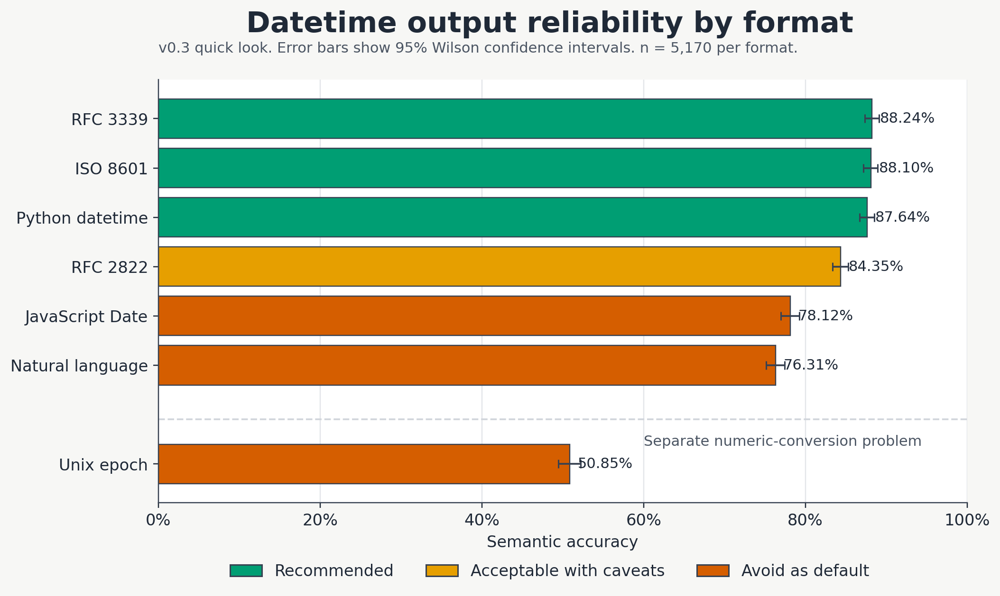
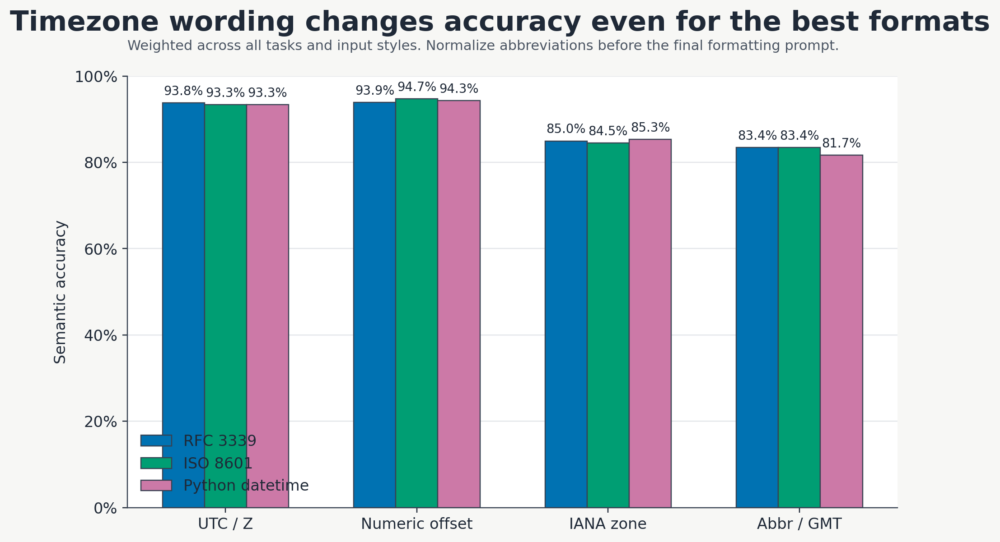

# datetime-bench

Benchmark for measuring how reliably LLMs generate datetime values across common output formats.

> [!NOTE]
> _datetime-bench_ was built for [Memory Store](https://memory.store), a cognitive memory architecture for LLM applications. Memory Store uses LLMs to resolve relative time expressions into grounded timestamps for episodic memory, so datetime format choice is a production concern.

## tl;dr

> [!TIP]
> If you ask an LLM to emit a machine-facing timestamp, use `rfc_3339`.

- Default: `rfc_3339`
- Effectively tied on measured accuracy: `iso_8601`
- Fine for Python-only systems: `python_datetime`
- Avoid as machine-facing defaults: `javascript_date`, `natural_language`
- Do not ask the model for `unix_epoch` unless you must; emit a string timestamp and convert to epoch in code

`v0.3` confirms the same practical story as earlier versions, but under a more realistic benchmark shape: input diversity and parsing / normalization did not change the top recommendation. The best string formats are still a tight cluster, and `unix_epoch` is still much worse than every string format.

## Quick Look

`v0.3` is the current publication snapshot.

- `22` active model cells across Google, Anthropic, OpenAI, Qwen, and GLM
- `2` probe-skipped cells: `qwen_large_r`, `glm_med_r`
- `235` scenarios
- `7` output formats
- `36,190` stored result rows
- `$120.64` total spend





### String-Only Leaderboard

This is a datetime-format reliability leaderboard, not a general model ranking.

| Rank | Model cell | Selected model | Mode | String-only accuracy |
| --- | --- | --- | --- | --- |
| `1` | `google_large_nr` | `google/gemini-3.1-pro-preview` | `non_reasoning` | `91.49%` |
| `2` | `anthropic_med_r` | `anthropic/claude-sonnet-4.6` | `reasoning` | `91.35%` |
| `3` | `openai_med_nr_chat` | `openai/gpt-5.3-chat` | `non_reasoning` | `91.13%` |
| `4` | `openai_med_r` | `openai/gpt-5.4` | `reasoning` | `91.13%` |
| `5` | `anthropic_large_r` | `anthropic/claude-opus-4.6` | `reasoning` | `90.85%` |

Quick interpretation:

- `rfc_3339` is the best default output contract at `88.24%` overall accuracy
- `iso_8601` is effectively tied at `88.10%`; the recommendation difference is about contract specificity, not a meaningful accuracy gap
- `python_datetime` stays close behind at `87.64%` and is a strong Python-native option
- `unix_epoch` drops to `50.85%` and behaves like a separate numeric-conversion problem

## For Prompt Engineers

### Recommended Contract

Ask for `rfc_3339` unless your system already has a strong reason to do otherwise.

Why:

- highest overall accuracy in `v0.3`
- statistically tied with `iso_8601` and `python_datetime`
- narrow, explicit wire contract
- no weekday token, so no strict-vs-relaxed penalty

If you already use a full-timestamp `iso_8601` contract, that is fine. The benchmark result does not justify migrating away from it for accuracy reasons alone.

### Copy-Paste Prompt Pattern

```text
System: Return exactly one RFC 3339 timestamp. No prose, no label, no code fence.

User: Resolve the datetime below. If the source uses timezone abbreviations or GMT-style wording, first normalize them to an explicit numeric offset or UTC/Z form. Output exactly one RFC 3339 timestamp:

<source text>
```

Good prompt-contract patterns:

- `Return exactly one RFC 3339 timestamp.`
- `Use a numeric offset or Z.`
- `No explanation, no extra text.`

Bad prompt-contract patterns:

- `Return an ISO date.` — too broad
- `Return a Unix timestamp.` — pushes exact numeric conversion onto the model
- `Return the answer in natural language.` — invites phrasing drift

### Production Pipeline Pattern

If you need a timestamp from an LLM in production:

1. Normalize source timezone wording to `UTC`, `Z`, or an explicit numeric offset when possible.
2. Ask the model for `rfc_3339`.
3. Parse and validate the output in code.
4. Convert to epoch in code if the downstream system requires it.

```python
from dateutil.parser import isoparse

timestamp = call_llm(...)
dt = isoparse(timestamp)
epoch_seconds = int(dt.timestamp())
```

### What Matters Most In Practice

Timezone wording is one of the biggest controllable variables in the whole benchmark.

Weighted semantic accuracy for the top three formats:

| Timezone style | `rfc_3339` | `iso_8601` | `python_datetime` |
| --- | --- | --- | --- |
| `utc_or_z` | `93.79%` | `93.33%` | `93.33%` |
| `numeric_offset` | `93.89%` | `94.74%` | `94.32%` |
| `iana_zone` | `84.96%` | `84.49%` | `85.34%` |
| `abbr_or_gmt` | `83.43%` | `83.43%` | `81.67%` |

Practical advice:

- prefer `UTC`, `Z`, or explicit numeric offsets in prompts and intermediate representations
- normalize timezone abbreviations like `EST`, `PDT`, or `GMT+0000` before the final formatting request
- keep compact structured intermediate forms when possible; they are safer than free-form restatements

Observed reasoning-vs-non-reasoning uplift for the top formats:

| Format | Non-reasoning | Reasoning | Observed delta |
| --- | --- | --- | --- |
| `rfc_3339` | `86.22%` | `91.16%` | `+4.94` points |
| `iso_8601` | `86.25%` | `90.78%` | `+4.53` points |
| `python_datetime` | `85.20%` | `91.16%` | `+5.95` points |

> [!IMPORTANT]
> These are production-configuration comparisons, not a clean causal estimate of reasoning alone. Reasoning cells ran at `temperature=1.0`; non-reasoning cells ran at `temperature=0.0`.

### How Failures Break Down

Among incorrect string-format outputs in `v0.3`, the dominant failure modes were:

- `syntax_error`: `30.02%`
- `arithmetic_error`: `28.45%`
- `extraction_error`: `12.97%`
- `timezone_error`: `12.41%`
- `day_of_week_error`: `11.82%`

This lines up with the practical advice:

- the model is usually better at canonical string emission than exact arithmetic-heavy conversion
- weekday-bearing formats pay a real tax
- timezone wording drift shows up as a distinct failure mode, not just noise

## For Researchers

### What This Benchmark Measures

`datetime-bench` measures zero-shot, first-attempt reliability for model-generated datetime outputs. The main question is not whether models understand time in the abstract, but which requested output format gives the most reliable machine-parseable answer when the model must both solve the task and emit the result in a specific wire shape.

Current `v0.3` scope:

- `7` output formats: `iso_8601`, `rfc_3339`, `rfc_2822`, `python_datetime`, `javascript_date`, `natural_language`, `unix_epoch`
- `7` task families and `235` scenarios
- `24` planned model cells, `22` active after probe filtering
- OpenRouter-hosted models across Google, Anthropic, OpenAI, Qwen, and GLM

### Methods In Brief

Each scenario is expanded across all output formats. The underlying task stays the same while the requested output format changes, which isolates format reliability from task difficulty.

Each response is scored on three levels:

1. **Syntactic validity**: does the output parse as the requested format?
2. **Semantic correctness**: does the parsed datetime match the gold answer within the task-specific tolerance?
3. **Strict correctness**: is the delta exactly zero seconds and the parse strict, with weekday consistency enforced where relevant?

The headline accuracy metric in the README is semantic correctness.

### Key Caveats And Limitations

- zero-shot only
- free-text generation only; no structured output / JSON mode / constrained decoding
- one trial per case; no repeated sampling variance estimate
- English-only prompts
- OpenRouter is the only provider in this benchmark, so routing and provider implementation details may matter
- no retry or self-correction behavior is tested
- reasoning-vs-non-reasoning comparisons are confounded by request shape, especially `temperature`
- the timezone chart is a descriptive benchmark aggregate, not a controlled causal estimate of timezone wording alone

### Why `rfc_3339` Over `iso_8601`

The measured gap is tiny: `rfc_3339` finished at `88.24%`; `iso_8601` finished at `88.10%`. The reason to prefer `rfc_3339` is not that it is dramatically easier for the model. The reason is that `rfc_3339` names a narrower, more precise timestamp contract.

If you ask for `iso_8601`, you are asking for a broad family of valid shapes. If you ask for `rfc_3339`, you are asking for a specific full timestamp shape that is easier to use as a production prompt contract.

### Task-Family Findings

Best and worst format by task family:

| Task type | Best format | Accuracy | Worst format | Accuracy |
| --- | --- | --- | --- | --- |
| `direct_generation` | `rfc_3339` | `99.87%` | `unix_epoch` | `60.26%` |
| `temporal_arithmetic` | `rfc_3339` | `79.09%` | `unix_epoch` | `40.57%` |
| `multi_hop_reasoning` | `python_datetime` | `86.36%` | `unix_epoch` | `45.06%` |
| `format_conversion` | `iso_8601` | `92.73%` | `unix_epoch` | `57.14%` |
| `extraction_from_passage` | `rfc_3339` | `79.55%` | `unix_epoch` | `46.67%` |
| `edge_cases` | `python_datetime` | `85.71%` | `unix_epoch` | `48.57%` |
| `parsing_normalization` | `iso_8601` | `99.09%` | `unix_epoch` | `61.64%` |

The top string formats remain strong across all task families. The hard cases are still arithmetic, multi-hop reasoning, and messy timezone handling.

## What The Model Actually Has To Do

These are not simple format-conversion tests. The benchmark requires the model to do real reasoning, then emit the answer in a specific format.

**Direct generation**:

```text
Prompt:  "Convert the following datetime to rfc 3339:
          July 14, 2020 at 8:10 AM, US Central time (CDT, UTC-5)"

Answer:  2020-07-14T08:10:00-05:00
```

**Temporal arithmetic**:

```text
Prompt:  "What is the date and time exactly 47 days after
          March 9, 2028 at 3:00 PM UTC? Output in rfc 3339."

Answer:  2028-04-25T15:00:00+00:00
```

**Multi-hop reasoning**:

```text
Prompt:  "A server was deployed on January 15, 2027 at 9:00 AM UTC.
          Its SSL certificate expires exactly 90 days later.
          A renewal reminder should fire 7 days before expiry
          at the same local time.
          When does the reminder fire? Output in rfc 3339."

Answer:  2027-04-08T09:00:00+00:00
```

**DST edge cases**:

```text
Prompt:  "What time is it 2 hours after March 9, 2025 at 1:30 AM
          in timezone America/New_York? Output in rfc 3339."

Answer:  2025-03-09T04:30:00-04:00
```

**Extraction from passage**:

```text
Prompt:  "Read the following passage and extract the meeting date.
          Output in rfc 3339.

          Priya, the VP of Operations, circulated a note to 17 attendees
          about the upcoming review. The final agenda was locked on
          March 12, 2029 at 5:25 PM +11:00. A separate travel hold
          remains in place until June 3, 2031 at 10:15 AM +11:00.
          The discussion will cover risk review and compliance,
          and room 204 has already been reserved."

Answer:  2029-03-12T17:25:00+11:00
```

## Artifacts

Current `v0.3` report artifacts:

- [summary.md](reports/datetime_bench_v0.3/summary.md)
- [PROGRAM_REPORT.md](reports/datetime_bench_v0.3/PROGRAM_REPORT.md)
- [LEARNINGS.md](reports/datetime_bench_v0.3/LEARNINGS.md)
- [format_comparison.csv](reports/datetime_bench_v0.3/format_comparison.csv)
- [format_comparison_string_only.csv](reports/datetime_bench_v0.3/format_comparison_string_only.csv)
- [input_variant_summary.csv](reports/datetime_bench_v0.3/input_variant_summary.csv)
- [epoch_summary.csv](reports/datetime_bench_v0.3/epoch_summary.csv)
- [error_taxonomy.csv](reports/datetime_bench_v0.3/error_taxonomy.csv)
- [cost_report.csv](reports/datetime_bench_v0.3/cost_report.csv)
- [results_all.csv](reports/datetime_bench_v0.3/results_all.csv) — full row-level results for every model × format × scenario
- [render_readme_figures.py](scripts/render_readme_figures.py) — regenerates the README quick-look figures from the checked-in `v0.3` snapshot

> [!IMPORTANT]
> The checked-in `reports/` directory is a publication snapshot. The `v0.3` run artifacts and generated CSVs are included in this checkout, but earlier historical runs are not all present in raw form.

## How To Cite

If you want to cite this benchmark, cite the repository and the `v0.3` snapshot explicitly.

```bibtex
@misc{datetime_bench_v0_3,
  title = {datetime-bench v0.3: Benchmark for Measuring Datetime Format Generation Reliability in LLMs},
  author = {{Memory Store}},
  year = {2026},
  url = {https://github.com/MemoryStore/datetime-bench},
  note = {GitHub repository, v0.3 report snapshot, accessed 2026-03-26}
}
```

## Version History

| Version | Main result | Spend |
| --- | --- | --- |
| `v0.1` | `iso_8601` led the original three-format benchmark | `~$7.45` |
| `v0.1.5` | `python_datetime`, `rfc_3339`, and `iso_8601` formed a top cluster | `~$15.37` |
| `v0.2` | same practical recommendation, with stronger family / size evidence | `$148.45` |
| `v0.3` | same recommendation holds under input diversity and parsing / normalization | `$120.64` |

The recommendation did not materially change across versions. `v0.3` mainly strengthens confidence that the advice survives messier and more realistic inputs.

## Related Work

`datetime-bench` focuses on a specific question: which output format do LLMs produce most reliably? Several adjacent benchmarks exist, but they do not directly target output-format reliability as a production contract problem.

Closest work:

- [DATETIME](https://arxiv.org/abs/2504.16155) (Gaere & Wangenheim, 2025) — benchmarks datetime translation to ISO 8601 and datetime arithmetic across 58 models; closest in domain, but not a format-comparison benchmark
- [DateLogicQA](https://arxiv.org/abs/2412.13377) (NAACL 2025 SRW) — studies how date format affects LLM comprehension on the input side; complementary to this benchmark's output-side question

Temporal reasoning benchmarks with a broader task focus:

- [TimeBench](https://aclanthology.org/2024.acl-long.66.pdf) (ACL 2024) — event ordering, duration QA, and temporal NLI
- [TRAM](https://aclanthology.org/2024.findings-acl.382/) (ACL 2024) — large multiple-choice temporal reasoning benchmark
- [Test of Time](https://arxiv.org/abs/2406.09170) (2024) — temporal semantics and arithmetic

Those benchmarks test whether LLMs understand time. `datetime-bench` tests whether they can emit a downstream-safe timestamp format after doing the reasoning.

## Running The Benchmark

```bash
uv sync
export OPENROUTER_API_KEY="sk-or-..."

# Dry run
datetime-bench --dry-run

# Full run
datetime-bench
```

Raw artifacts go to `runs/`. Analysis outputs go to `reports/`.

## Repo Layout

```text
src/datetime_bench/
  config.py
  runner.py
  openrouter.py
  analysis.py
  evaluation/
  tasks/
reports/
  datetime_bench_v0.1/
  datetime_bench_v0.1.5/
  datetime_bench_v0.2/
  datetime_bench_v0.3/
```

## Contributing

Contributions are welcome. The most useful additions are:

**Add a model.** Edit the `MODEL_CELLS` list in `src/datetime_bench/config.py` with the new model's OpenRouter identifier. Run `datetime-bench --dry-run` first to verify that the model resolves and responds to the probe.

**Add an output format.** Add a new `FormatSpec` entry in the format configuration, implement a parser in `src/datetime_bench/evaluation/parsers.py`, and wire it into the scoring dispatch in `src/datetime_bench/evaluation/scoring.py`.

**Add a task family.** Create a new task generator in `src/datetime_bench/tasks/`, register it in the task loader, and add a semantic threshold in `config.py` if the task type warrants a different tolerance.

**Report a scoring issue.** If you find a case where the evaluation is wrong, open an issue with the `case_id`, model, and expected vs. actual score.

## License

[MIT](LICENSE)
